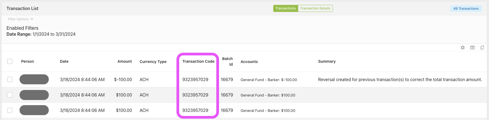

# Deduplicating Transaction Records
## Overview
There is a System Job named **Download Payments** [Id: 21](https://rock.vrl.church/admin/system/jobs/21).
This Job is scheduled to run every day at 11:59pm

This Job ran twice for 6 days, resulting in a lot of duplicated rows in three tables:
1. `[FinancialTransaction]` ([Script As Create](./FinancialTransaction.sql))([Rock Model Map: FinancialTransaction](https://rock.vrl.church/admin/power-tools/model-map?EntityType=2c1cb26b-ab22-42d0-8164-aedee0dae667))
1. `[FinancialTransactionDetail]` ([Script As Create](./FinancialTransactionDetail.sql))([Rock Model Map: FinancialTransactionDetail](https://rock.vrl.church/admin/power-tools/model-map?EntityType=ac4ac28b-8e7e-4d7e-85db-dffb4f3adcce))
1. `[FinancialPaymentDetail]` ([Script As Create](./FinancialPaymentDetail.sql))([Rock Model Map: FinancialPaymentDetail](https://rock.vrl.church/admin/power-tools/model-map?EntityType=f3659077-43fd-4805-bc42-bc8a3f9c3008))

**Note**: The deduplication of tables must happen in the opposite order because of dependencies/references. In other words, DELETE rows from `[FinancialTransaction]` last, not first.

**Note**: As I am writing this, I am beginning to suspect that `[FinancialScheduledTransaction]` ([Script As Create](./FinancialScheduledTransaction.sql))([Rock Model Map](https://rock.vrl.church/admin/power-tools/model-map?EntityType=76824e8a-ccc4-4085-84d9-8af8c0807e20)) and `[FinancialScheduledTransactionDetail]` ([Script As Create](./FinancialScheduledTransactionDetail.sql))([Rock Model Map](https://rock.vrl.church/admin/power-tools/model-map?EntityType=a206615f-3fb5-48df-b606-86ae8716fd57)) might also need deduplication. It's worth at least auditing.

## Visual
Look at this screenshot:

<ol>
    <li>TransactionCode '9323957029' is a transaction that only occurred once in Celero.</li>
    <li>It was downloaded twice from Celero because the System Job ran twice simultaneously.</li>
    <li>It was later "reversed" by a different System Job as an attempt to reconcile the fact that our Rock instance recorded this transaction twice, when Celero only records it once.<ul><li>It's worth noting that the Person in question only got charged once, and never received a refund (since there was no second transaction in need of reversal)</li></ul></li>
</ol>

This is another way to visualize the magnitude of the problem:
```sql
WITH FilteredTransactions AS (SELECT [Id] FROM [FinancialTransaction] WHERE [CreatedDateTime] > '2024-03-12')

SELECT
    ft.[TransactionDateTime]
  , ft.[TransactionCode]
  , COUNT(*) AS 'TransactionCount'
FROM
    [FinancialTransaction] ft
WHERE
    ft.[Id] IN (SELECT [Id] FROM FilteredTransactions)
GROUP BY
    ft.[TransactionDateTime]
  , ft.[TransactionCode]
HAVING
    COUNT(*) > 1
ORDER BY
    ft.[TransactionDateTime] DESC
;
```

The above SELECT query would show a result kinda like this:
| TransactionDateTime     | TransactionCode | TransactionCount |
|-------------------------|-----------------|------------------|
| 2024-03-18 08:44:06.000 | 9323957029      | 3                |
| 2024-03-17 00:00:00.000 |                 | 5                |
| 2024-03-06 08:43:03.000 | 9318803573      | 11               |

**Note**: Let's focus on the duplications that happened on or after 2024-MAR-13

Prior to writing this SELECT statement, I didn't know `TransactionCode` could be blank. I don't know how and why `TransactionCode` could be blank.

Looks like there are 167 TransactionCodes that have more than one `FinancialTransaction` associated with it.